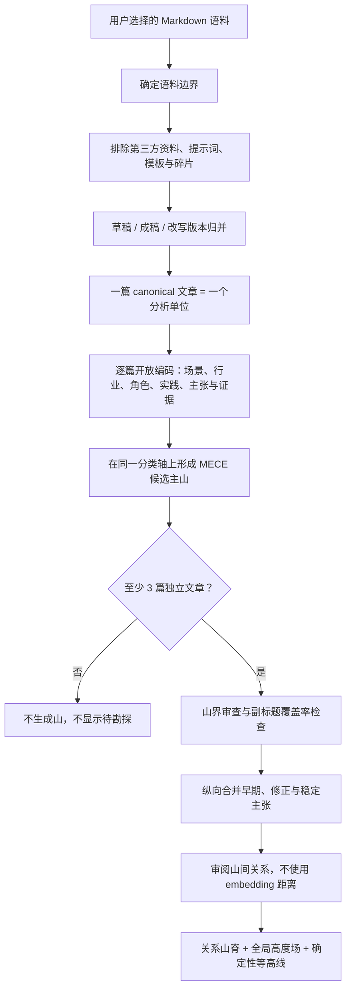

# 文山.skill

> 用山脉展示你的篇章。


把一组 Markdown 或 Obsidian 篇章，经过语义审阅、版本归并和证据门槛判断，生成一张可以回到原文的个人知识山脉地图。

文山不照抄文件夹，不用词频冒充洞察，也不依赖 embedding 猜文章距离。山名是 Agent 从语料中归纳出的长期问题空间，篇数是积累量，副标题是作者在这个方向上逐渐形成的回答。

```bash
npx skills add pakco77/wenshan-skill \
  --skill knowledge-peak-map \
  --agent '*' \
  --global \
  --yes \
  --full-depth
```

跨 Agent 使用：Codex、Claude Code、CodeWhale、CodeBuddy、WorkBuddy，以及其他支持 [Agent Skills](https://agentskills.io/) 的宿主。

看效果 · 装上就能用 · 判断逻辑 · 真实案例 · 方法说明 · 视觉皮肤

---

## Demo


当前默认皮肤是 `survey-parchment`：黑白灰、羊皮纸、测绘仪器感；保留等高线作为核心视觉资产。

---

## 装上就能用

安装后直接对 Agent 说：

```text
使用 $knowledge-peak-map 分析这个 Markdown 文章集合。
作者昵称是 Pakco，生成中文文山地图。
```

或者：

```text
分析这个 Obsidian 文件夹里的草稿和成稿。
先排除第三方资料和模板，归并文章版本，再生成文山。
```

输入只有三个：

1. 作者昵称；
2. 用户明确选择的 Markdown / Obsidian 文章集合；
3. 中文或英文界面。

文山不会默认扫描整个 Vault，不会修改源文章，也不要求上传到远程服务。

---

## 五个能力

| 用户想做什么 | 文山能力 | 主要产物 |
|---|---|---|
| 清掉提示词、模板、参考资料和碎片 | 语义审阅 | `cards/*.json` |
| 草稿、成稿、改写不能重复抬高海拔 | 版本归并 | canonical 分析单位 |
| 找出长期反复写作的问题空间 | MECE 主山识别 | `wenshan-terrain.json` |
| 提炼每个方向上逐渐稳定的回答 | 纵向主张综合 | 山峰副标题与时间演化 |
| 把证据变成可探索、可传播的地图 | 确定性等高线渲染 | 中英 HTML、Markdown、截图 |

---

## 它怎么判断一座山



两个容易被忽略的规则：

- **主山必须 MECE。** 主山共享一个分类轴；媒介、格式、工具或具体方法如果被某个主题完整包含，只能成为子峰。
- **山数不是目标。** 3 座、7 座或 20 座都可能正确；正确性来自证据门、同层级分类和唯一主归属。

详细方法文章：**[为什么文山不是 Topic Model：判断逻辑、研究来源与应用边界](docs/why-wenshan.md)**。

---

## 一座山怎么读

| 地图元素 | 含义 |
|---|---|
| 主山名 | 语料中长期重复出现的具体问题空间，例如 `AI工具`、`产品经理`、`CNC` |
| 副标题 | Agent 综合山内文章后，提炼出的作者当前回答 |
| `16篇` | 16 篇独立 canonical 文章；表示积累量，不表示知识水平 |
| 子峰 | 被主山包含、但仍值得保留的稳定实践或分支 |
| 证据点 | 一篇原始文章，可点击回到 Markdown 或 Obsidian |
| 山间远近 | 经过审阅的语义关系，不是 embedding 相似度 |
| 山脊与鞍部 | 两座山之间反复出现的共享实践、因果连接或纵向转变 |
| 右下时间戳 | 本次分析与地图生成时间 |

至少 3 篇独立文章才能形成一座山。没有证据，就没有山。

---

## 真实分类案例

一组 102 个 Markdown 文件经过审阅后：

- 87 篇独立 canonical 文章；
- 80 篇进入地图；
- 7 篇保留为低于证据门的 outlier；
- 最终形成 7 座主山。

其中两次关键修正：

| 错误的平级山 | 修正后 |
|---|---|
| `HTML表达 · 5篇` | 并入 `AI工具`，成为子峰 |
| `AI认知 · 9篇` | 并入 `AI行业`，改为 `人机边界` 子峰 |

这不是为了减少山数，而是因为 `HTML表达` 是 AI 工具进入排版、演示和视觉工作流的具体载体；`AI认知` 则是观察 AI 行业变化时形成的人机边界视角。父子级内容不能并排冒充 MECE。

完整的极简案例：[`case-wenchi-mece.md`](knowledge-peak-map/references/case-wenchi-mece.md)。

---

## 视觉皮肤

文山的视觉不能变成普通数据仪表盘。无论皮肤如何变化，都必须保留：

- 等高线；
- 文章证据点；
- 主山篇数；
- 单色或克制色彩；
- 原文回链；
- 3:4 传播画幅；
- 地图整体是一张山脉群，不是若干孤立圆环。

| 皮肤 | 视觉方向 | 状态 |
|---|---|---|
| `survey-parchment` | 羊皮纸 × 测绘仪器 × 黑白灰精密线条 | 当前默认 |
| `mythic-parchment` | 古代幻想制图 × 手工刻线 × 山脊排线；保留文学感但不复制任何现成作品 | 设计规格 |
| `archive-engraving` | 十九世纪地理图志 × 铜版雕刻 × 博物馆档案 | 设计规格 |

下一套推荐实现 `mythic-parchment`。它不是简单把背景染黄，而是改变地形线的生成方式：多尺度山脊、带限崎岖、主次等高线和克制坡线，让曲线更像真实山脉，而不是平滑高斯线圈。

详见：[视觉皮肤与“神话羊皮纸”设计规格](docs/visual-themes.md)。

---

## 在 Obsidian 里使用

选择一个文章文件夹作为 `scope`。推荐只包含作者自己的草稿和成稿：

```text
文章集合/
├── 草稿/
├── 成稿/
└── Cognitive Map/
    └── Agent Atlas/
```

对支持本地文件能力的 Agent 说：

```text
使用 $knowledge-peak-map 分析：
/absolute/path/to/文章集合

作者：Pakco
语言：中文
目标：生成文山地图
```

派生文件只会写入：

```text
Cognitive Map/Agent Atlas/
├── cards/
├── runs/
├── review.md
├── wenshan-terrain.json
├── 文山.md
└── 文山.html
```

如果已经有经过审阅的卡片与地形数据，也可以直接渲染：

```bash
python3 knowledge-peak-map/scripts/render_territory_demo.py \
  --scope "/absolute/path/to/collection" \
  --nickname "Pakco" \
  --language zh \
  --output-name "文山"
```

---

## 方法定位

文山使用 **证据门槛式纵向框架分析**：

> Evidence-Gated Longitudinal Framework Analysis，EGLFA

这是文山组合现有研究方法形成的工程化方法规格，不是已经存在的论文方法名。它吸收：

- Framework Method；
- 定性内容分析；
- 扎根理论的开放编码与主轴编码；
- 纵向定性分析；
- Argument Mining；
- 人类可理解性验证。

它不是 topic modeling，也不是 embedding 聚类。统计模型可以帮助搜索，但不能替代“这个主题是否对作者本人有意义”的人类可理解性验收。

阅读完整说明：[docs/why-wenshan.md](docs/why-wenshan.md)。

---

## 可信边界

- 只读取用户明确选择的文章集合。
- 只有 `include: true` 且 `canonical: true` 的唯一原文路径才能增加海拔。
- 同一篇文章只增加一座主山的高度。
- 主山必须在同一分类轴上通过 MECE 审查。
- 被父主题完整包含的媒介、格式、方法或视角只能作为子峰。
- 山间距离来自显式审阅关系，不来自 embedding。
- 篇数代表积累量，不代表知识水平、权威性或正确性。
- 文章标题保留原文，不因为界面切换中英文而自动翻译。
- 没有可靠日期时，不把结果包装成纵向分析。

---

## 仓库结构

```text
wenshan-skill/
├── README.md
├── LICENSE
├── docs/
│   ├── why-wenshan.md
│   └── visual-themes.md
└── knowledge-peak-map/
    ├── SKILL.md
    ├── agents/
    ├── assets/
    ├── references/
    │   ├── methodology.zh.md
    │   ├── methodology.en.md
    │   ├── data-contract.md
    │   └── case-wenchi-mece.md
    └── scripts/
        ├── render_territory_demo.py
        └── self_check.py
```

---

## License

[MIT](LICENSE) © 2026 Pakco

如果文山帮助你重新看见自己的写作资产，欢迎 Star；如果你设计了新的地形皮肤、分析案例或宿主适配，欢迎提交 PR。
