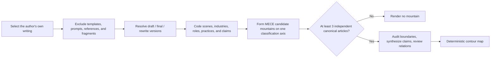

# Wenshan.skill / 文山.skill

**English** · [简体中文](README.zh-CN.md)

> Turn a Markdown writing collection into a personal knowledge mountain range that always leads back to the source.

[](https://skills.sh/pakco77/wenshan-skill/knowledge-peak-map)
[](VERSION)
[](https://agentskills.io/)
[](LICENSE)


Wenshan reviews authorship and document quality, resolves draft/final versions, and then identifies recurring **scenes, industries, roles, and practices** as mountains. Every visible mountain must pass an evidence gate; every count, evidence point, and synthesized answer can be traced to the original article.

It is not a folder chart or an embedding cluster map. **A mountain name is a recurring concrete problem space, its article count is accumulated writing volume, and its subtitle is the author's current answer in that area.**

> **Beta 1.0** (`1.0.0-beta.1`) is a public field test. The analysis contract and renderer are usable; schemas and host-specific adapters may still change before a stable release.

---

## Install in one minute

Requirements: Node.js, Python 3.10+, and a local-file-capable Agent.

```bash
npx skills add pakco77/wenshan-skill --skill knowledge-peak-map -g
```

Check that the repository exposes the Skill:

```bash
npx skills add pakco77/wenshan-skill --list
```

<details>
<summary>Install for a specific Agent or every detected compatible Agent</summary>

```bash
# Codex
npx skills add pakco77/wenshan-skill \
  --skill knowledge-peak-map \
  --agent codex \
  --global \
  --yes

# Claude Code
npx skills add pakco77/wenshan-skill \
  --skill knowledge-peak-map \
  --agent claude-code \
  --global \
  --yes

# Every compatible Agent detected on this machine
npx skills add pakco77/wenshan-skill \
  --skill knowledge-peak-map \
  --agent '*' \
  --global \
  --yes
```

For CodeWhale, CodeBuddy, WorkBuddy, and manual installation, read the
[Agent compatibility guide](knowledge-peak-map/references/agent-compatibility.md).

</details>

---

## First run

Send this to your Agent and replace the path and nickname:

```text
Use $knowledge-peak-map to analyze:
/absolute/path/to/my-writing

Author nickname: Pakco
Interface language: English
Goal: Generate a Wenshan map
```

If your host does not use `$skill-name` syntax, say: “Use the knowledge-peak-map Skill to analyze this directory.”

Wenshan needs only:

1. an author nickname;
2. a user-selected Markdown or Obsidian writing directory;
3. an interface language: English or Chinese.

It does not scan the whole vault by default, edit source articles, or upload writing to a remote service.

### No Markdown yet?

Use [huashu-md-html](https://github.com/alchaincyf/huashu-md-html) to convert PDF, DOCX, PPTX, XLSX, HTML, web pages, EPUB, images, audio, or ZIP archives into clean Markdown first:

```bash
npx skills add alchaincyf/huashu-md-html --skill huashu-md-html -g
```

Then ask your Agent:

```text
Use $huashu-md-html to convert these source files into a clean Markdown collection.
After I review the converted files, use $knowledge-peak-map to generate Wenshan.
```

The two Skills remain separate on purpose: `huashu-md-html` prepares the corpus; Wenshan reviews evidence, resolves versions, audits mountain boundaries, and renders the map.

### What you receive

```text
writing/
└── Cognitive Map/
    └── Agent Atlas/
        ├── cards/                 # auditable semantic card per article
        ├── runs/                  # analysis and review records
        ├── review.md              # boundary cases and human decisions
        ├── wenshan-terrain.json   # mountains, counts, evidence, relations
        ├── Wenshan.md             # readable analysis summary
        └── Wenshan.html           # zoomable, clickable, shareable map
```

The generated HTML supports:

- English and Chinese interface switching while preserving original article titles;
- wheel and keyboard zoom plus pointer panning;
- peak focus and a reverse-chronological source-article drawer;
- daylight parchment and night atlas themes;
- 3:4 share-image export;
- links back to Markdown or Obsidian source notes.

---

## When Wenshan is useful

- **You have many articles but cannot clearly name what you keep returning to.**
- **Drafts, finals, and rewrites are mixed together, so ordinary counts are inflated.**
- **You do not want folders, tags, word frequency, or vector similarity to decide your knowledge structure.**
- **You want a personal writing asset that is explainable, auditable, and visually shareable.**

Wenshan can analyze public-account articles, essays, research notes, project retrospectives, decision records, reading notes, and portfolios. Obsidian is a recommended container, not a requirement; an ordinary Markdown directory is enough.

---

## How Wenshan decides that a mountain exists

Wenshan uses **Evidence-Gated Longitudinal Framework Analysis (EGLFA)**. EGLFA is a Wenshan-defined engineering specification that combines established qualitative research practices; it is not the established name of a published research method.



Core rules:

- one version-resolved canonical article is one independent analysis unit;
- one article adds altitude to only one primary mountain;
- a main mountain is a noun phrase strongly anchored to a scene, industry, role, or practice;
- main mountains should be MECE on one declared classification axis;
- a contained medium, format, tool, or method becomes a subpeak, not a peer mountain;
- a mountain requires at least three independent articles; no evidence means no mountain;
- mountain proximity comes from explicit semantic review, not embedding distance;
- article count represents accumulated writing volume, not expertise, authority, or correctness.

Read the complete [English EGLFA method specification](knowledge-peak-map/references/methodology.en.md).

---

## How to read the map

| Map element | Meaning |
|---|---|
| Mountain name | A recurring concrete problem space, such as `AI Tools`, `Product Management`, or `CNC` |
| `16 pieces` | 16 independent canonical articles; accumulated volume, not a capability score |
| Solid triangle | Peak summit and interaction target |
| Subtitle | The Agent's synthesis of the author's current answer in this area |
| Peripheral evidence labels | Recurring scenes or practices supported by articles inside the mountain |
| Article dots | Real source articles that open titles, dates, summaries, and original paths |
| Mountain proximity | Reviewed semantic relations, shared practices, or longitudinal transitions |
| Contours and ridges | One continuous mountain range, not a set of disconnected rings |
| Bottom-right timestamp | Analysis and render time |

---

## How it differs from common approaches

| Approach | What it usually answers | Wenshan's treatment |
|---|---|---|
| Folder or tag chart | Where a file was stored | Re-reads article meaning instead of copying the directory |
| Word frequency or word cloud | Which words appear often | A frequent brand or term does not automatically become a mountain |
| Topic model | Which statistical topics may exist | Final topics must pass evidence and human-interpretability gates |
| Embedding clustering | Which texts are close in vector space | Mountain relations are explicit, explainable, and editable |
| Generic knowledge graph | Which entities are connected | Wenshan also represents accumulated writing, claim evolution, and mountain boundaries |

---

## Real classification case

A collection of 102 Markdown files was reviewed:

- 87 independent canonical articles;
- 80 articles entered the map;
- 7 remained below the evidence gate as outliers;
- 7 main mountains were produced.

Two important boundary corrections:

| Incorrect peer mountain | Reviewed result |
|---|---|
| `HTML Expression · 5 articles` | Moved under `AI Tools` as a subpeak |
| `AI Cognition · 9 articles` | Moved under `AI Industry` as the `Human–AI Boundaries` subpeak |

This was not an attempt to force a fixed mountain count. It prevented parent and child topics from appearing as peers. Read the compact
[MECE case](knowledge-peak-map/references/case-wenchi-mece.md).

---

## Use with Obsidian

Select a directory that primarily contains the author's own drafts and finals:

```text
writing/
├── drafts/
└── published/
```

Ask your Agent:

```text
Use $knowledge-peak-map to analyze this Obsidian writing collection:
/absolute/path/to/writing

Author: Pakco
Language: English
Exclude non-author work, resolve versions, and then generate Wenshan.
```

Derived files are written only to `Cognitive Map/Agent Atlas/` inside the selected collection. Rendering never rewrites source Markdown or semantic cards.

If reviewed cards and `wenshan-terrain.json` already exist, run only the deterministic renderer:

```bash
python3 knowledge-peak-map/scripts/render_territory_demo.py \
  --scope "/absolute/path/to/collection" \
  --nickname "Pakco" \
  --language en \
  --theme obsidian-atlas \
  --output-name "Wenshan"
```

---

## Visual themes

A visual theme may change paper, lines, typography, grid, selection treatment, and controls. It must never change mountain names, counts, evidence points, reviewed relations, or terrain coordinates.

| Theme | Direction | Status |
|---|---|---|
| `survey-parchment` | Parchment × surveying instrument × restrained monochrome lines | Implemented |
| `obsidian-atlas` | Black archival paper × warm gray-sepia contours × evidence stardust | Implemented |
| `mythic-parchment` | Ancient speculative cartography × hand-cut contours × restrained slope marks | Design specification |
| `archive-engraving` | Nineteenth-century geographic atlas × copper engraving × museum archive | Design specification |

---

## Safety and trust boundaries

- Read only the user-selected collection.
- Never scan the whole vault by default.
- Never edit source articles.
- Require no vector database or embedding service.
- Never publish private article bodies or absolute local paths.
- Only unique source paths with both `include: true` and `canonical: true` add altitude.
- Do not claim longitudinal analysis when reliable dates are unavailable.
- Send ambiguous article assignments and mountain boundaries to `review.md` instead of silently guessing.

---

## Development and validation

```bash
git clone https://github.com/pakco77/wenshan-skill.git
cd wenshan-skill
python3 knowledge-peak-map/scripts/self_check.py
```

Repository structure:

```text
wenshan-skill/
├── README.md
├── README.zh-CN.md
├── VERSION
├── LICENSE
├── assets/
├── docs/
└── knowledge-peak-map/
    ├── SKILL.md
    ├── agents/
    ├── assets/
    ├── references/
    └── scripts/
```

The renderer and self-check use only the Python standard library. Contributions are welcome for corpus cases, host adapters, validation rules, and visual themes, provided that visual changes preserve the same semantic data.

---

## License

[MIT](LICENSE) © 2026 Pakco

If Wenshan helps you see your writing as an accumulated body of work, consider starring the repository. If you find a wrong mountain boundary or a new use case, open an Issue or PR.
