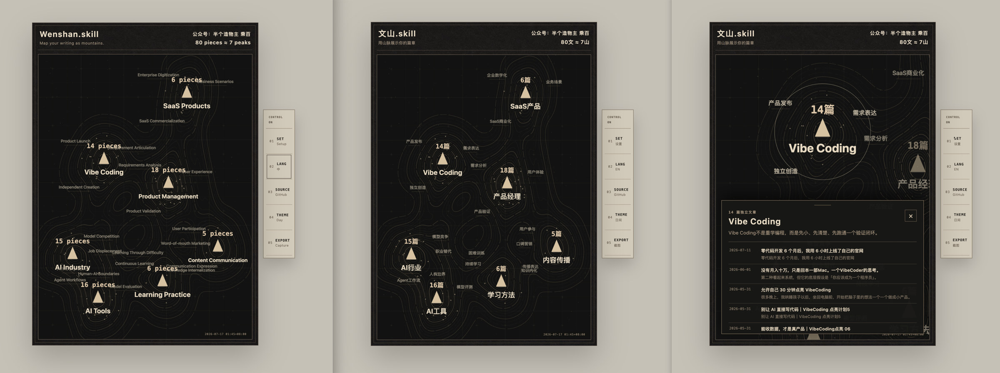
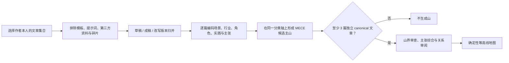

# 文山.skill / Wenshan.skill

[English](README.md) · **简体中文**

> 把一组 Markdown 篇章，变成一张能回到原文的个人知识山脉地图。

[](https://skills.sh/pakco77/wenshan-skill/knowledge-peak-map)
[](VERSION)
[](https://agentskills.io/)
[](LICENSE)




文山先审阅文章、排除脏数据、归并草稿与成稿，再从**场景、行业、角色和实践**中归纳主山。每座山必须通过证据门；每一个篇数、证据点和副标题都能回到原文。

它不是文件夹统计图，也不是 embedding 聚类图。**山名代表反复写作的具体问题空间，篇数代表独立文章积累量，副标题代表作者目前形成的回答。**

> **Beta 1.0**（`1.0.0-beta.1`）是公开试水版本。分析契约与地图渲染器已经可用，但数据结构和宿主适配在稳定版之前仍可能调整。

---

## 1 分钟安装

需要 Node.js、Python 3.10+，以及一个能读取本地文件的 Agent。

```bash
npx skills add pakco77/wenshan-skill --skill knowledge-peak-map -g
```

安装器会识别 Codex、Claude Code 等兼容宿主。确认是否发现 Skill：

```bash
npx skills add pakco77/wenshan-skill --list
```

<details>
<summary>指定 Agent 或安装到全部兼容 Agent</summary>

```bash
# Codex
npx skills add pakco77/wenshan-skill \
  --skill knowledge-peak-map \
  --agent codex \
  --global \
  --yes

# Claude Code
npx skills add pakco77/wenshan-skill \
  --skill knowledge-peak-map \
  --agent claude-code \
  --global \
  --yes

# 安装到本机所有被识别的兼容 Agent
npx skills add pakco77/wenshan-skill \
  --skill knowledge-peak-map \
  --agent '*' \
  --global \
  --yes
```

CodeWhale、CodeBuddy、WorkBuddy 或其他宿主的安装方式见
[Agent 兼容与手动安装](knowledge-peak-map/references/agent-compatibility.md)。

</details>

---

## 第一次使用

把下面这段话发给 Agent，只需替换文章目录和昵称：

```text
使用 $knowledge-peak-map 分析：
/absolute/path/to/my-writing

作者昵称：Pakco
界面语言：中文
目标：生成文山地图
```

如果宿主不使用 `$skill-name` 语法，就说“使用 knowledge-peak-map Skill 分析这个目录”。

输入只需要三个信息：

1. 作者昵称；
2. 用户明确选择的 Markdown / Obsidian 文章目录；
3. 中文或英文界面。

文山默认不会扫描整个 Vault，不会修改源文章，也不会把文章上传到远程服务。

### 还没有 Markdown 文档？

可以先使用花叔的 [huashu-md-html](https://github.com/alchaincyf/huashu-md-html)，把 PDF、DOCX、PPTX、XLSX、HTML、网页、EPUB、图片、音频或 ZIP 转成干净的 Markdown：

```bash
npx skills add alchaincyf/huashu-md-html --skill huashu-md-html -g
```

然后对 Agent 说：

```text
使用 $huashu-md-html 把这些源文件转换成干净的 Markdown 文章集合。
我检查转换结果后，再使用 $knowledge-peak-map 生成文山。
```

两个 Skill 刻意保持分工：`huashu-md-html` 负责准备 Markdown 语料；文山负责语义审阅、版本归并、山界判断与地图生成。

### 你会得到什么

```text
文章目录/
└── Cognitive Map/
    └── Agent Atlas/
        ├── cards/                 # 每篇文章的可审计语义卡
        ├── runs/                  # 分析过程与复核记录
        ├── review.md              # 边界案例与人工决策
        ├── wenshan-terrain.json   # 山名、篇数、证据与山间关系
        ├── 文山.md                # 可阅读的分析摘要
        └── 文山.html              # 可缩放、可点击、可截图的地图
```

最终 HTML 支持：

- 中英文界面切换，文章标题保留原文；
- 滚轮与键盘缩放、拖动画布；
- 点击山峰聚焦并查看倒序文章证据；
- 日间羊皮纸与夜间图志皮肤；
- 3:4 传播截图；
- 从证据点返回 Markdown 或 Obsidian 原文。

---

## 什么时候值得用

- **文章已经很多，但你说不清自己长期在写什么。**
- **草稿、成稿和改写版本混在一起，普通统计会重复计数。**
- **你不想让标签、文件夹或向量相似度替你决定知识结构。**
- **你想把个人写作资产做成一张可解释、可验证、可传播的地图。**

它适用于公众号文章、随笔、研究笔记、项目复盘、决策记录、阅读笔记和作品集。Obsidian 是推荐容器，不是必需条件；一个普通 Markdown 文件夹也能使用。

---

## 文山如何判断一座山

文山使用 **证据门槛式纵向框架分析**（Evidence-Gated Longitudinal Framework Analysis，EGLFA）。这是文山组合现有研究方法形成的工程化规格，不是一个既有论文方法名。



核心规则：

- 一篇经过版本归并的 canonical 文章，是一个独立分析单位；
- 同一篇文章只增加一座主山的篇数；
- 主山必须是与场景、行业、角色或实践强相关的名词短语；
- 主山必须在一个声明过的分类轴上尽量 MECE；
- 被主山完整包含的媒介、格式、工具或方法，只能成为子峰；
- 至少 3 篇独立文章才能形成一座山；没有证据，就没有山；
- 山间远近来自显式语义审阅，不来自 embedding 距离；
- 篇数表示写作积累量，不表示知识水平、权威性或正确性。

完整方法文章：
**[为什么文山不是 Topic Model：判断逻辑、研究来源与应用边界](docs/why-wenshan.md)**。

---

## 一张图应该怎么读

| 地图元素 | 含义 |
|---|---|
| 主山名 | 语料中长期重复出现的具体问题空间，例如 `AI工具`、`产品经理`、`CNC` |
| `16篇` | 16 篇独立 canonical 文章；它是积累量，不是能力评分 |
| 实心三角 | 主山峰顶与交互入口 |
| 副标题 | Agent 综合山内文章后，提炼出的作者当前回答 |
| 外围证据词 | 山内反复出现、并能回溯到文章的场景或实践 |
| 文章点 | 一篇真实文章；点击后可查看标题、日期、摘要与原文路径 |
| 山间远近 | 经过审阅的语义关系、共享实践或纵向转变 |
| 等高线与山脊 | 多座主山组成的一张连续山群，而不是互不相干的圆环 |
| 右下时间戳 | 本次分析与地图生成时间 |

---

## 它和常见做法有什么不同

| 做法 | 它通常回答什么 | 文山的处理 |
|---|---|---|
| 文件夹 / 标签统计 | 文件被放在哪里 | 不复制目录结构，重新审阅文章语义 |
| 词频与词云 | 哪些词出现得多 | 品牌名或高频词不会自动成为山 |
| Topic Model | 文本中可能有哪些统计主题 | 最终主题必须通过人类可理解性与证据门 |
| Embedding 聚类 | 哪些文本在向量空间接近 | 山间距离使用显式审阅关系，可解释、可修改 |
| 普通知识图谱 | 实体之间有哪些连接 | 文山还表达文章积累量、主张演化与山界 |

---

## 真实分类案例

一组 102 个 Markdown 文件经过审阅后：

- 87 篇独立 canonical 文章；
- 80 篇进入地图；
- 7 篇保留为低于证据门的 outlier；
- 最终形成 7 座主山。

两次关键修正：

| 错误的平级山 | 修正后 |
|---|---|
| `HTML表达 · 5篇` | 并入 `AI工具`，成为子峰 |
| `AI认知 · 9篇` | 并入 `AI行业`，改为 `人机边界` 子峰 |

这里不是为了把山压缩到某个数量，而是避免父主题与子主题并排冒充 MECE。完整案例见
[`case-wenchi-mece.md`](knowledge-peak-map/references/case-wenchi-mece.md)。

---

## 在 Obsidian 里使用

推荐只选择作者自己的草稿与成稿：

```text
文章集合/
├── 草稿/
└── 成稿/
```

对 Agent 说：

```text
使用 $knowledge-peak-map 分析这个 Obsidian 文章集合：
/absolute/path/to/文章集合

作者：Pakco
语言：中文
先排除非作者作品并归并版本，再生成文山地图。
```

派生文件只写入当前文章集合下的 `Cognitive Map/Agent Atlas/`。源 Markdown 和语义卡片不会在渲染阶段被改写。

如果已经有经过审阅的卡片与 `wenshan-terrain.json`，也可以只运行确定性渲染器：

```bash
python3 knowledge-peak-map/scripts/render_territory_demo.py \
  --scope "/absolute/path/to/collection" \
  --nickname "Pakco" \
  --language zh \
  --theme obsidian-atlas \
  --output-name "文山"
```

---

## 视觉皮肤

皮肤只改变纸张、线条、字体、网格、选中状态和控制组件；不能改变山名、篇数、证据点、山间关系或地形坐标。

| 皮肤 | 视觉方向 | 状态 |
|---|---|---|
| `survey-parchment` | 羊皮纸 × 测绘仪器 × 黑白灰精密线条 | 已实现 |
| `obsidian-atlas` | 黑色纸面 × 暖灰金褐等高线 × 星尘证据层 | 已实现 |
| `mythic-parchment` | 古代幻想制图 × 手工刻线 × 克制坡线 | 设计规格 |
| `archive-engraving` | 十九世纪地理图志 × 铜版雕刻 × 博物馆档案 | 设计规格 |

详见：[视觉皮肤设计规格](docs/visual-themes.md)。

---

## 安全与可信边界

- 只读取用户明确选择的文章集合；
- 不默认扫描整个 Vault；
- 不修改源文章；
- 不需要向量数据库，不调用 embedding 服务；
- 不把私人文章或绝对路径写入公共仓库；
- 只有 `include: true` 且 `canonical: true` 的唯一原文路径才能增加篇数；
- 没有可靠日期时，不把结果包装成纵向分析；
- 边界不清的文章与山界进入 `review.md`，而不是静默猜测。

---

## 开发与验证

```bash
git clone https://github.com/pakco77/wenshan-skill.git
cd wenshan-skill
python3 knowledge-peak-map/scripts/self_check.py
```

仓库结构：

```text
wenshan-skill/
├── README.md
├── README.zh-CN.md
├── VERSION
├── LICENSE
├── assets/
├── docs/
│   ├── why-wenshan.md
│   └── visual-themes.md
└── knowledge-peak-map/
    ├── SKILL.md
    ├── agents/
    ├── assets/
    ├── references/
    └── scripts/
```

Renderer 与自检仅使用 Python 标准库。欢迎提交新的语料案例、宿主适配、验证规则或视觉皮肤，但请确保同一份语义数据在不同皮肤下保持完全一致。

---

## License

[MIT](LICENSE) © 2026 Pakco

如果文山让你重新看见了自己的写作资产，欢迎 Star；如果你发现了错误山界或新的使用场景，欢迎提交 Issue 或 PR。
