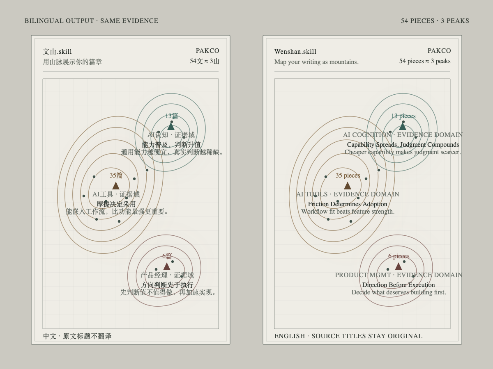

# 文山.skill / Wenshan.skill



**中文：用山脉展示你的篇章。** Read [中文工作流](references/workflow.zh.md).
**English: Map your writing as mountains.** Read the [English workflow](references/workflow.en.md).

For source ingestion, read [文章与文档进入 Markdown/Obsidian 的前置链路](references/article-ingestion.md).
For exact card and terrain fields, read the [data contract](references/data-contract.md).
For host installation, read [Agent compatibility](references/agent-compatibility.md).
For the Obsidian shell, read [中文方案](references/obsidian-plugin.zh.md) or [English architecture](references/obsidian-plugin.en.md).

## Product contract

Render reviewed judgments; never infer document proximity with embeddings.

- Make the mountain's main title a short, transferable rule extracted by the local Agent from the current corpus.
- Keep an optional topic or evidence domain as subordinate context, never as the mountain name.
- Make the subtitle a concise explanation of how the evidence supports the rule.
- Count only cards with `decision.include: true` and `decision.canonical: true`.
- Require at least three independent source paths before rendering a rule as a mountain.
- Render no label, contour, placeholder, or “to be explored” state below the evidence gate.
- Use the number of independent canonical articles as altitude.
- Keep original evidence article titles in their source language.

Reject labels that are only categories, products, vendors, media types, or user-entered aspirations. Prefer causal or decision rules such as `摩擦决定采用`, `能力普及，判断升值`, or `方向判断先于执行`.

## Inputs

Accept:

1. `nickname`: attribution in the map and share export.
2. `scope`: an absolute path to a selected Obsidian or Markdown collection.
3. `language`: `zh` or `en`.

Do not scan an entire vault by default. Analyze only the collection the user selected.

The reviewed scope contains:

```text
Cognitive Map/Agent Atlas/
├── cards/*.json
└── wenshan-terrain.json
```

Write `wenshan-terrain.json` as the auditable semantic source. Each retained mountain stores a stable `id`, optional `domain`, extracted `rule`, evidence-based `explanation`, bilingual reviewed variants, and card IDs. Use the exact schema in [data-contract.md](references/data-contract.md).

If English copy is absent, preserve the source language. Never silently machine-translate evidence article titles.

## Semantic workflow

Use the user's local Agent to:

1. Collect only the selected article set.
2. Exclude prompts, templates, operating manuals, third-party examples, empty files, and invalid JSON.
3. Resolve drafts, finals, and rewrites into version families with one canonical representative.
4. Compare canonical judgments and cluster articles that repeatedly express the same causal or decision rule.
5. Name each cluster with a compact rule, not a topic category.
6. Keep an optional evidence domain for orientation.
7. Retain only rules supported by at least three independent canonical source paths.
8. Assign every article to one primary rule mountain; allow up to two non-altitude cross-links.
9. Write one explanation that answers why the rule is present in this corpus.
10. Validate IDs, counts, paths, inclusion decisions, and bilingual fields.

The renderer is deterministic after semantic preparation. Fix a wrong mountain by revising the evidence or rule extraction, never by tuning coordinates.

## Render

Chinese:

```bash
python3 scripts/render_territory_demo.py \
  --scope "/absolute/content-scope" \
  --nickname "作者昵称" \
  --language zh \
  --output-name "文山"
```

English:

```bash
python3 scripts/render_territory_demo.py \
  --scope "/absolute/content-scope" \
  --nickname "Author" \
  --language en \
  --output-name "Wenshan"
```

Write derived HTML and Markdown only inside `Cognitive Map/Agent Atlas/`. Never edit source notes or semantic cards during rendering.

## Geometry and interaction

- Generate contours from deterministic evidence points, a Gaussian density field, and marching squares.
- Let article count determine relative altitude and mass.
- Preserve contour lines as the core visual asset; use shading only to improve depth perception.
- Fit mountains into the framed viewport on desktop and portrait exports.
- Open a detail panel with the extracted rule, explanation, count, and original article titles.
- Export a 1080×1440 share image without controls or local source paths.

## Validation

Run:

```bash
python3 scripts/self_check.py
```

Then verify that every visible mountain has at least three unique canonical paths, the summed mountain count equals the unique rendered article count, Chinese and English outputs share identical terrain data, generated JavaScript parses, and both pages render without clipping.

## Reuse boundary

Apply the same contract to essays, research notes, project retrospectives, decision records, reading notes, portfolios, or any Markdown collection that has passed semantic review and canonical version resolution. Do not tie rules or geometry to public-account articles, a single user's taxonomy, or fixed topic IDs.
