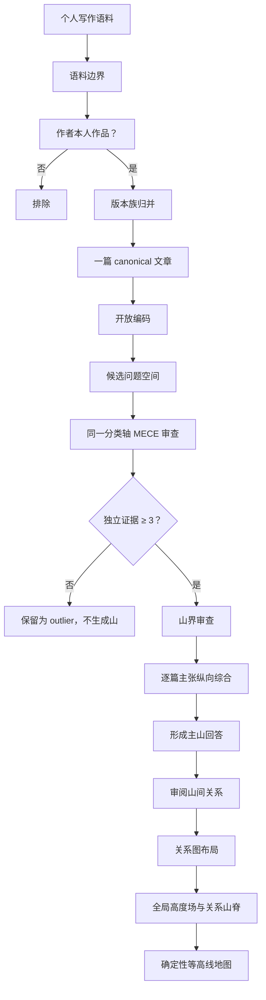
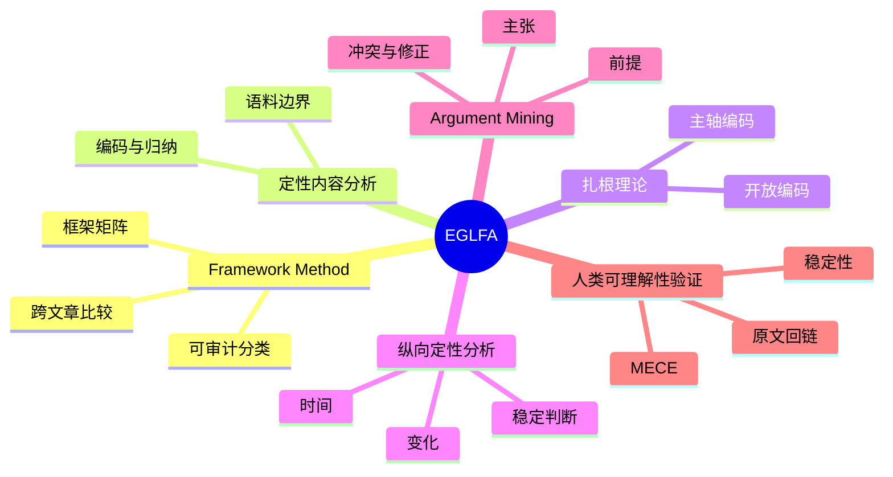

# 为什么文山不是 Topic Model

## 一种面向个人写作语料的证据门槛式纵向知识地图

文山要回答的问题不是“这些文章在向量空间里靠不靠近”，而是：

> 一个人在长期写作中，反复进入了哪些具体问题空间；每个问题空间积累了多少独立文章；作者目前形成了什么回答；这个回答又如何随时间变化。

这四个问题分别对应文山地图中的：

- 山名：长期问题空间；
- 海拔：独立 canonical 文章数；
- 副标题：作者当前的稳定回答；
- 时间地层：回答的形成、修正与稳定过程。

文山把这一方法规格命名为：

> **证据门槛式纵向框架分析**  
> Evidence-Gated Longitudinal Framework Analysis，EGLFA

这个名称是文山组合现有研究方法形成的工程规格，不是一个已经存在的论文方法名。

---

## 为什么不能只做 embedding 聚类

embedding 很适合检索，也可以帮助发现候选邻居，但它无法独立回答三个关键问题：

1. 两篇文章相似，是因为作者的长期关心相同，还是因为它们碰巧出现了相同品牌、工具或新闻事件？
2. 一个高频词应该成为主山，还是只是另一个主题内部使用的媒介、案例或方法？
3. 模型产生的主题对统计目标更好，是否就对人更有解释力？

Chang 等人在 *Reading Tea Leaves* 中通过人类实验指出，topic model 的统计表现更好，并不保证主题对人更有语义解释力。这正是文山坚持“最终必须通过人类可理解性验收”的原因：[Reading Tea Leaves: How Humans Interpret Topic Models](https://papers.nips.cc/paper_files/paper/2009/hash/f92586a25bb3145facd64ab20fd554ff-Abstract.html)。

所以文山的原则是：

> embedding 可以帮助找材料，但不能决定山名、山界、海拔和山间距离。

---

## 文山的判断逻辑



### 1. 语料边界

输入必须明确：

- 作者；
- 文件集合；
- 时间范围；
- 文档类型；
- 是否为作者本人作品。

排除：

- 第三方参考；
- 提示词；
- 操作说明；
- 模板；
- 空文件；
- 未完成碎片；
- 非作者作品。

这一步决定“什么可以成为作者的山”。如果把资料库、提示词和别人的文章一起算入，地图展示的只是硬盘内容，不是作者的知识积累。

### 2. 版本归并

文山统一规定：

> 一篇经过版本归并后的 canonical 文章，是一个独立分析单位。

同一篇文章的草稿、成稿、平台改写和标题测试不能重复抬高海拔。

### 3. 逐篇开放编码

每篇文章至少抽取：

```json
{
  "scene": [],
  "industry": [],
  "role": [],
  "practice": [],
  "knowledge_domain": [],
  "claim": "",
  "premises": [],
  "evidence": [],
  "date": "",
  "confidence": 0.0
}
```

这里借鉴扎根理论的开放编码思想：先从语料中生成概念，不让用户预先输入“我想成为哪几座山”。

### 4. 在一个分类轴上形成 MECE 主山

候选山必须是名词或名词短语，并与场景、行业、角色、实践或知识领域有强关系。

但“有三篇文章”还不够。主山还必须共享一个分类轴，例如：

```text
classification_axis = primary_problem_space
```

每篇文章回答的主要问题属于哪个问题空间，就只增加那一座主山的高度。

同时做包含关系检查：

- `HTML表达` 如果只是 AI 工具进入排版、演示和审美工作流的载体，就应成为 `AI工具` 子峰；
- 某品牌如果只是大量文章中的案例，就不能因为词频高而成为品牌山；
- 一种方法如果被更大的实践主题完整包含，就只能成为子峰。

MECE 不是要求世界本身互不重叠，而是要求当前地图的主山在一个明确的分析轴上互斥、共同覆盖。

### 5. 通过证据门

一座山至少满足：

- 3 篇独立 canonical 文章；
- 每篇都能解释为什么属于这座山；
- 副标题覆盖山内大多数文章；
- 同一篇文章只增加一座主山海拔；
- 没有证据就没有山。

证据门的价值不是证明作者“懂了”，而是防止一次偶然写作被包装成长期方向。

### 6. 山界审查

对每座山问：

1. 是否吸收了超过一半的有效文章？
2. 山内是否存在三个以上稳定子主题？
3. 任取五篇，是否都能解释为什么属于这座山？
4. 副标题是否覆盖至少 70% 的山内文章？
5. 如果拆山，子山是否仍各有三篇以上证据？
6. 候选山是否只是另一个主山内部的媒介、格式、方法或视角？

不通过时进入人工复核，而不是让模型强行给出一个看似完整的答案。

### 7. 纵向综合回答

副标题不应该是 LLM 临场写的一句漂亮话。

文山采用：

```text
提取每篇 claim
→ 合并同义主张
→ 找出反例与冲突
→ 按时间排列
→ 区分早期主张、修正主张、稳定主张
→ 形成当前回答
```

这一步和 Argument Mining 的目标相近：从文本中识别主张、前提及其关系，再形成可审计的论证表示。相关综述可参考 Peldszus 与 Stede 的 [From argument diagrams to argumentation mining in texts](https://www.ling.uni-potsdam.de/~peldszus/ijcini2013-preprint.pdf)。

### 8. 稳定性验收

同一份语料独立分析三次：

- 山名语义是否一致；
- 文章主山归属是否稳定；
- 海拔是否一致；
- 副标题是否表达相同判断；
- 所有证据是否能回到原文。

建议门槛：

| 指标 | 门槛 |
|---|---:|
| 山峰数量差异 | ≤ 1 |
| 核心山名语义一致率 | ≥ 80% |
| 文章主山归属 Jaccard | ≥ 0.75 |
| 海拔计数 | 100% 一致 |
| 原文可追溯 | 100% |

---

## 理论来源



### Framework Method

Gale 等人把 Framework Method 描述为一种系统且灵活的定性资料分析方法，核心包括熟悉资料、编码、形成分析框架、将资料放入矩阵并进行解释。文山借用它来组织“文章 × 山峰 × 主张 × 时间”的可审计矩阵：[Using the framework method for the analysis of qualitative data](https://doi.org/10.1186/1471-2288-13-117)。

### 纵向定性分析

纵向定性研究关注的不是多个时间点的静态主题，而是“变化如何发生”。文山因此要求按日期区分早期、修正和稳定主张，而不是把多年文章压成一个无时间的词云。可参考 [Time and change: a typology for presenting research findings in qualitative longitudinal research](https://pmc.ncbi.nlm.nih.gov/articles/PMC10698947/)。

### Argument Mining

Argument Mining 为“从文章中提取主张、前提和论证结构”提供方法来源。文山不追求自动判定真理，而是利用这一结构综合“作者目前形成了什么回答”。

---

## 从语义判断到地图

地图不是分析本身，而是分析结果的可视化。

文山将语义层与渲染层严格分开：

```text
语义层：
文章 → canonical → 主山 → 子峰 → 山间关系 → 当前回答

渲染层：
文章数 → 峰值高度
山间关系 → 远近与连接山脊
证据文章 → 地图点
全局高度场 → 等高线
```

渲染器不能偷偷修改语义判断。山名错误，要回到分类；山间距离错误，要回到关系审阅；不能靠手调坐标掩盖分析问题。

---

## 可以用在哪里

文山不只适用于公众号文章，还可以用于：

- 个人博客和 Newsletter；
- 研究笔记；
- 项目复盘；
- 决策记录；
- 学习日志；
- 投资备忘；
- 产品经理案例库；
- 设计作品说明；
- 长期职业写作；
- 多年日记中的稳定议题。

前提是：

- 语料属于同一作者或明确的分析主体；
- 文档可以版本归并；
- 有足够日期信息；
- 每篇文档具有可分析的主张；
- 用户接受“没有证据就没有山”。

---

## 不适合用在哪里

- 只有十几条碎片化短句；
- 大量复制资料但缺少作者判断；
- 多作者混合语料却不区分作者；
- 没有日期却要求分析长期演化；
- 想用地图证明作者的知识水平；
- 想把 embedding 聚类换一层漂亮皮肤；
- 想预先指定几座山，再要求模型找证据配合。

---

## 最终定位

文山不是词云、topic model、向量聚类或笔记标签的可视化。

它是一种：

> 以文章为分析单位、以框架矩阵为审计结构、以独立 canonical 文章为证据门槛、以 MECE 问题空间形成主山、以论证综合提取作者回答、以纵向时间分析观察判断变化、最后用确定性等高线呈现的个人写作语料分析方法。

篇数代表积累量，不直接代表知识水平；山名代表长期问题空间；子峰代表被主山包含的稳定实践；副标题代表作者目前形成的回答；时间地层代表这个回答如何演化。

