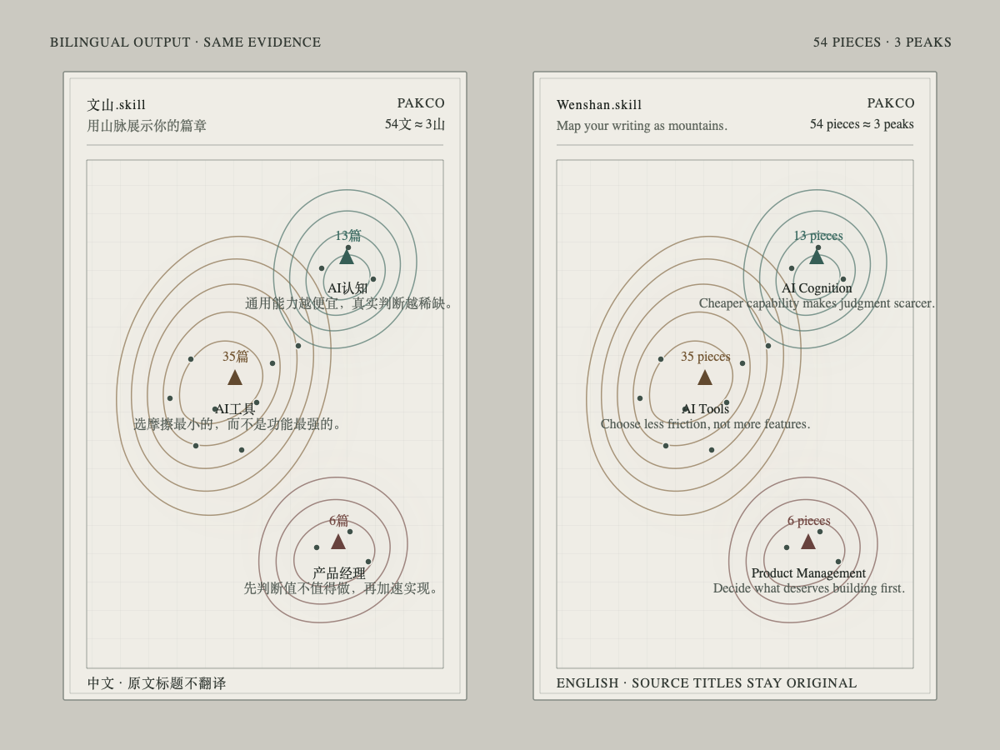

# 文山.skill / Wenshan.skill



**中文：用山脉展示你的篇章。** Read [中文工作流](references/workflow.zh.md).
**English: Map your writing as mountains.** Read the [English workflow](references/workflow.en.md).

Review authorship and document quality, resolve draft/final versions, identify concrete scene or industry mountains, and render a traceable contour map without embedding-based similarity.

The analysis method is **Evidence-Gated Longitudinal Framework Analysis (EGLFA)**: a Wenshan-defined composite specification, not an established published method name. It combines the Framework Method, qualitative content analysis, grounded-theory coding, longitudinal thematic analysis, and argument mining. Read the detailed [中文方法规格](references/methodology.zh.md) or [English method specification](references/methodology.en.md).

Read only what the task needs: [source ingestion](references/article-ingestion.md), [data contract](references/data-contract.md), [host installation](references/agent-compatibility.md), or the [Obsidian shell](references/obsidian-plugin.zh.md).

When main-mountain hierarchy is ambiguous, read the compact [MECE classification case](references/case-wenchi-mece.md). Treat its labels as an example, never as a reusable user taxonomy.

## Contract

Render reviewed judgments; never infer document proximity with embeddings.

- Let the local Agent identify a concrete scene, practice, role, industry, or knowledge-domain keyword from the selected corpus. Never ask the user to predefine mountains.
- Preserve every distinct candidate mountain that passes the evidence gate. Do not cap the visible mountain count or force related domains into a single parent category.
- Make main mountains MECE on one declared classification axis. A medium, tool, format, technique, or other contained practice belongs under its parent mountain as an auditable subpeak; for example, `HTML表达` belongs under `AI工具` when the corpus treats HTML as an AI-assisted production medium.
- Keep peripheral evidence labels separate from subpeaks. Extract two or three recurring scene, practice, role, problem, or knowledge-domain noun phrases per mountain; cite at least two supporting cards for each label. Evidence labels decorate and explain the terrain but never add altitude or alter classification.
- Review mountain-to-mountain relationships explicitly. Use a deterministic relation graph to express semantic proximity, shared practice, causal connection, or longitudinal transition; never derive distance from embeddings.
- Use the Agent's evidence-backed answer as the subtitle.
- Count only unique source paths whose cards are both `include: true` and `canonical: true`; three paths make one mountain. Below that: render nothing.
- Use article count as accumulated writing volume, not knowledge level. Keep evidence titles in their source language.
- Require reviewed `label_kind` and `label_rationale` fields before rendering.
- Put the generation timestamp at the bottom center of the map and include it in the share image.

Prefer recognizable noun phrases with a strong scene or industry anchor, such as `AI工具`, `产品经理`, `CNC`, `智能硬件`, `AI认知`, or `育儿生活`. Reject slogans, full-sentence conclusions, abstract laws, user-entered aspirations, folder names copied without semantic review, and vendor names unless the corpus genuinely centers on that vendor.

## Input

Accept `nickname`, an absolute `scope` to a selected Markdown/Obsidian collection, and `language` (`zh` or `en`). Never scan the whole vault by default.

The reviewed scope contains:

```text
Cognitive Map/Agent Atlas/
├── cards/*.json
└── wenshan-terrain.json
```

Write `wenshan-terrain.json` as the auditable semantic source. Follow [data-contract.md](references/data-contract.md). If English copy is absent, preserve the source language; never silently translate evidence titles.

## EGLFA workflow

Use the user's local Agent to:

1. **Bound the corpus.** Record author, selected files, time range, document kinds, and authorship. Exclude third-party references, prompts, manuals, templates, empty files, unfinished fragments, and non-author work.
2. **Fix the analysis unit.** Treat one version-resolved canonical article as one independent unit. Drafts and rewrites never add duplicate altitude.
3. **Open-code every article.** Extract scenes, industries, roles, practices, knowledge domains, claim, premises, evidence, date, and confidence.
4. **Axially code candidate mountains.** Merge true synonyms and duplicate labels, but keep distinct related domains as separate mountains. Record reviewed relations between mountains so proximity and density can express how the author's concerns connect.
5. **Apply the evidence gate.** Require three unique canonical paths; explain every assignment; require one primary mountain per article; render no unsupported placeholder.
6. **Audit mountain boundaries.** Test corpus share, stable subthemes, five-article explainability, subtitle coverage of at least 70%, and whether a split would yield valid three-article subpeaks. Send triggered cases to human review.
7. **Synthesize the answer longitudinally.** Merge claims, find conflicts, order them by time, distinguish early, revised, and stable claims, then write the current answer.
8. **Test stability.** Run the same corpus three independent times. Require peak-count delta ≤ 1, core-label semantic agreement ≥ 80%, primary-assignment Jaccard ≥ 0.75, exact altitude counts, and source traceability.

Do not call an analysis longitudinal when reliable document dates or a meaningful time range are unavailable. Repair the dates or describe the result as an evidence-gated framework map without temporal claims.

The renderer is deterministic after semantic preparation. Render all evidenced mountains as one restrained monochrome range with no blurred terrain shadow. Place mountains from the reviewed relation graph, then combine their altitude fields and relation-derived ridges into one continuous terrain so every peak belongs to one mountain group. Smooth the global contours at high resolution. Support wheel/keyboard zoom, pointer panning, peak focus, and an article drawer. Fix a wrong mountain or distance by revising evidence or reviewed relations, never by tuning arbitrary coordinates.

## Render

Chinese:

```bash
python3 scripts/render_territory_demo.py \
  --scope "/absolute/content-scope" \
  --nickname "作者昵称" \
  --language zh \
  --theme survey-parchment \
  --output-name "文山"
```

Night reading skin:

```bash
python3 scripts/render_territory_demo.py \
  --scope "/absolute/content-scope" \
  --nickname "作者昵称" \
  --language zh \
  --theme obsidian-atlas \
  --output-name "文山-黑曜石图志"
```

English:

```bash
python3 scripts/render_territory_demo.py \
  --scope "/absolute/content-scope" \
  --nickname "Author" \
  --language en \
  --theme survey-parchment \
  --output-name "Wenshan"
```

`survey-parchment` and `obsidian-atlas` are visual skins over the same semantic payload. A skin may change paper, contour color, typography, grid, selection treatment, and controls. It must not change mountain labels, article counts, evidence points, reviewed relations, or terrain coordinates.

Write derived HTML and Markdown only inside `Cognitive Map/Agent Atlas/`. Never edit source notes or semantic cards during rendering.

## Validation

Run:

```bash
python3 scripts/self_check.py
```

Then verify counts, Chinese/English data parity, cross-theme semantic parity, generated JavaScript, the bottom-right timestamp, desktop fit, and the 1080×1440 export.

## Reuse boundary

Apply the same contract to essays, research notes, project retrospectives, decision records, reading notes, portfolios, or any Markdown collection that has passed semantic review and canonical version resolution. Do not tie labels or geometry to public-account articles, a single user's taxonomy, or fixed topic IDs.
